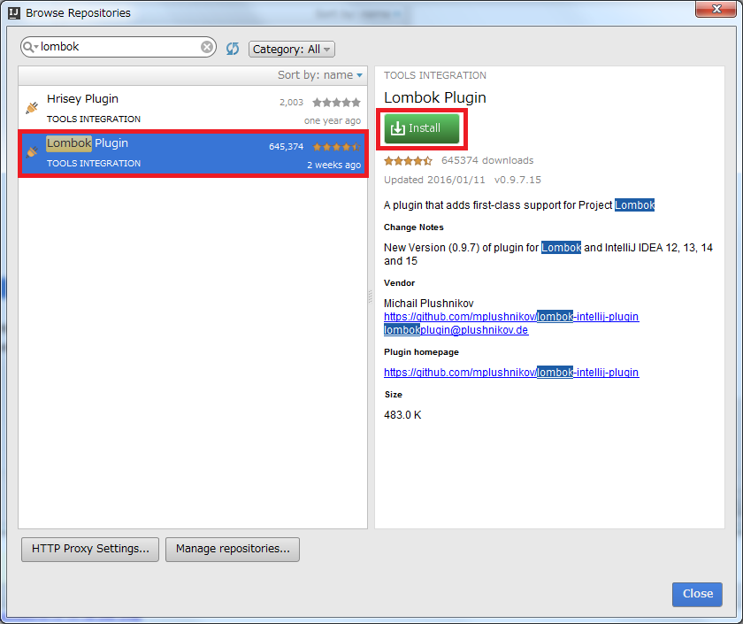
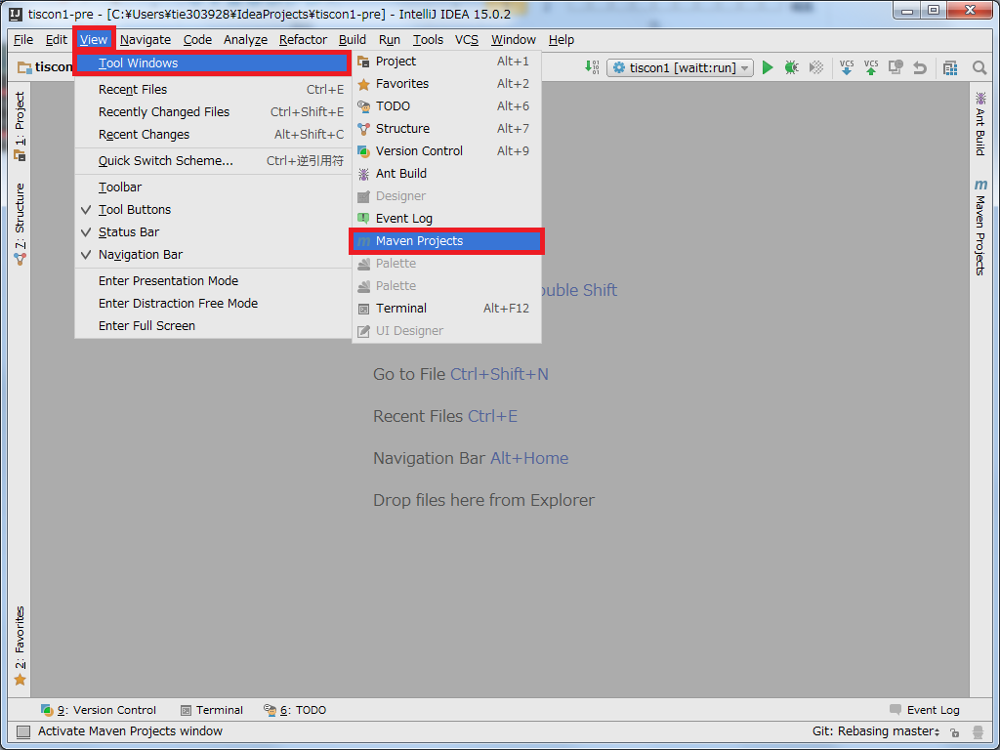
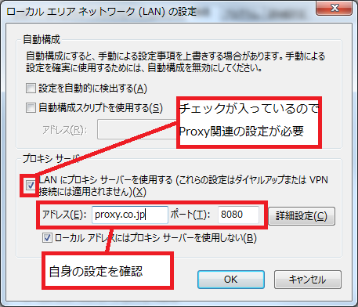
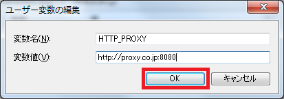
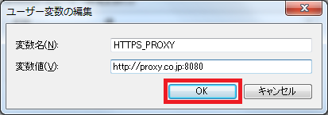
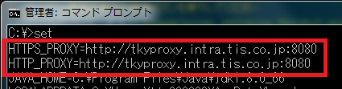

# 環境構築手順
本ドキュメントではtisconプロジェクト動作に必要となる環境構築の手順を示します。  
環境構築を行うに当たり、インターネット接続した状態で行って下さい。  
  
また、本ドキュメントは環境構築対象PCのOSがWindowsであると想定しています。  
他のOSの場合は、各自適した設定を行うようにしてください。  
  
作業想定時間は3~4時間です。当日万全の態勢で臨めるよう、早めに準備しておくよう心掛けてください。  

## 事前準備

### 自身の環境確認
下記サイトを参考に、PCで32bit版、64bit版のいずれを実行しているのかを調べます。  
[【Windowsの32bit版または64bit版のいずれを実行しているのか調べる】](http://windows.microsoft.com/ja-jp/windows7/find-out-32-or-64-bit)  

どちらで実行しているかにより、以降の作業でのインストール先が異なる場合があります。  
特に指定が無い場合、インストール先はデフォルトの設定で問題ありません。  

### ファイルの拡張子表示
下記サイトを参考に、拡張子を表示するよう設定してください。  
[【Windowsで拡張子を表示させる】](https://www.microsoft.com/ja-jp/atlife/tips/archive/windows/tips/252.aspx)

## JDK8
Java(プログラミング言語)で開発を行うのに必要なソフトウェアをまとめたパッケージです。  
下記サイトを参考に、**JDK8のインストール**及び**環境変数の設定**を行って下さい。  

[【JDK8(Java8)のインストール方法】](http://javaworld.helpfulness.jp/post-24/)  

※上記サイトに記載されたjdkのバージョンは最新ではありません(jdk-8u5)。  
  最新のバージョンをダウンロードしてください。1月末日時点での最新バージョンはjdk-8u71です。  

※環境変数のパス設定には、自身がインストールした先のパスを設定するよう注意してください。  

## Maven3
Apache Software Foundationで開発されているソフトウェアプロジェクト管理ツールです。  
下記サイトを参考に、**Maven3のインストール**及び**環境変数の設定**を行って下さい。  
下記サイトには「環境変数の設定は3つ」と記載がありますが、この項目でのJAVA_HOME、M2_HOMEの設定は不要です。  
今回は環境変数「PATH」1つのみの設定を行って下さい。  

[【Apache Maven3 (3.2.5) インストール手順】](http://weblabo.oscasierra.net/install-maven-32-windows/)  

※ファイルの展開先は以下の様に設定してください。  
`C:\Program Files`  
環境変数のパス設定には、展開先のパスを反映するよう注意してください。  

## IntelliJ IDEA
JetBrains社が開発した統合開発環境です。  
下記サイトを参考に、**IntelliJ IDEAのCommunity Editionをインストール**してください。  
また、併せてProject Settingsより**JDKの設定**を行って下さい。  
[【IntelliJ IDEA 14.0.2 インストール手順】](http://ksby.hatenablog.com/entry/2014/12/27/233427)  

※上記サイトに記載されているIntelliJ IDEAに関する項目のみ参照してください。  

※上記サイトに記載されたIntelliJのバージョンは最新ではありません(14.0.2)。  
  最新のバージョンをダウンロードしてください。1月末日時点での最新バージョンは15.0.3です。  

※環境変数のパス設定には、JAVAの設定を含め、自身がインストールした先のパスを設定するよう注意してください。  

※上記サイトは64bit版について記載されています。  
32bitの場合は初回起動時、「idea64.exe」ではなく同フォルダに存在する「idea.exe」を実行してください。

IntelliJを日本語化したい場合は下記を参考にしてください。  
[【IntelliJ IDEA 日本語化】](http://qiita.com/makoto2468/items/6abf614b82cab865b745)  
※jarファイルコピー先のフォルダには、自身がインストールしたパスの情報を反映させてください。

### プラグインの設定
1. IntelliJを起動し、Configre > Settings を選択します。  
  

1. Settingsウィンドウが表示されるので、左のバーからPluginsを選択し、Browse repositories...ボタンを押下します。  
  

1. 検索バーに`Lombok`と入力し、Lombok Pluginを選択します。  
   右側に表示されるInstallボタンを押下してください。  
   　※検索結果が表示されない場合はプロキシ問題である可能性があります。  
   　　[参考 - プロキシ](###プロキシの設定)の設定を参照してください。  
  

1. 同様に、検索バーに`Jackson`と入力し、Jackson Generator Pluginを選択します。  
   右側に表示されるInstallボタンを押下し、**IntelliJを再起動**してください。  

## Heroku
PaaSの1つであり、Webアプリケーションのオンライン上での公開を行えるプラットフォームです。  
下記サイトを参考に、**Herokuのアカウント作成**及び**Toolbeltのインストール**までを行って下さい。  
[【Herokuの準備】](http://railsgirls.jp/heroku/)  

## Github
Gitリポジトリのホスティングサービスです。  
gitに関しては下記を参照してください。  

- [【Git入門】](http://www.backlog.jp/git-guide/intro/intro1_1.html)
- [【ギットクエスト】](http://unit8.net/gq/)

### アカウント作成
下記サイトを参考に、**Githubのアカウント作成**を行って下さい。  
[【GitHub アカウントの作成方法】](http://fnya.cocolog-nifty.com/blog/2014/01/github-185e.html)

### tisconのFork
[github](https://github.com/)にログインし、下記ページの右上にあるForkボタンを押下してください。  
[【tiscon - Githubページ】](https://github.com/tiscon/tiscon1)  

## 動作確認

### IntelliJでのプロジェクトのclone手順
1. ユーザフォルダ配下にIdeaProjectsフォルダを作成します。
1. IntelliJを起動し、Check out from Version Control > Git を選択します。
1. Git Repository URLに以下を入力します。  
   `https://github.com/[Githubユーザ名]/tiscon1.git`
1. Cloneボタンを押下します。
   ※「The parent path～」と表示されている場合、Parent Directory項目右の…ボタンを押下し、作成したIdeaProjectsフォルダを選択してください。
1. 画面下部にステータスが表示されるます。バーの表示が消えればcloneは完了です。
   

### ソースコード確認
1. IntelliJ上部メニューバーから、View > Tool Windows > Projectを選択します。

1. Project Viewよりプロジェクト内のソースコードが確認できるようになりました。

### ローカルでの稼働確認
1. IntelliJ上部メニューバーから、View > Tool Windows > Maven Projectsを選択します。

1. 上部のMake Projectボタンを押下し、画面下部に全てのファイルが最新であることを示すメッセージが表示されることを確認します。

2. Maven Project Viewより、tiscon > Plugins > waitt > waitt:run をダブルクリックしてください。  
   画面下部にログが表示されます。「StaticResourceHandler　（中略） = /public」と表示されたらアプリケーションが起動しています。  
   ブラウザから http://localhost:8080 にアクセスすることでトップページが開きます。  
   ※初回実行時は数分かかりますが、以降は10秒ほどでアプリケーションが起動します。  
  

WAITTに関しては下記記事をお読みください。  
[【Webアプリ開発/テストのお供に『WAITT』】](http://qiita.com/kawasima/items/1d4daed6f980b4bfbee3)  

### オンライン上での動作確認
Heroku上にデプロイし、オンラインで動作することを確認しましょう。  
Herokuにログインした状態で、READMEの[環境構築]にある、デプロイボタンを押下してください。

## 参考

### プロキシの設定
自身のPCにプロキシが設定されている場合、別途設定が必要となります。  
※インターン当日はプロキシ設定が無い状態で行います。  

**自身の設定を確認する**  
1. Internet Explorerを起動します。  
1. ツール > インターネットオプションを選択します。  
  
  
1. インターネットオプションウィンドより、接続 > LANの設定を選択します。  

1. プロキシ サーバー内の「LANにプロキシサーバを使用する」にチェックがついていた場合、以降のプロキシの設定が必要となります。  
   記載されているアドレスとポートを控えておいてください。  
  
---
**IntelliJでのプロキシ設定**  
1. IntelliJの上部メニューバーより、File > Settings を選択します。  
  
  
1. Settingsウィンドウが表示されるので、左のバーからAppearance & Behavior > 一般 > HTTP Proxyを選択します。  

1. 「HTTPプロキシを使用する」を選択し、各自の設定を記載します。  

1. 下部OKボタンを押下します。  
  
---
**Heroku動作のためのプロキシ設定**  
環境変数に自身のプロキシについて設定する必要があります。  
1. スタート > コンピューターを右クリック > プロパティ > システムの詳細設定を選択してください。  
  

1. システムのプロパティウィンドウの詳細設定 > 環境変数を選択します。  
  

1. ユーザー環境変数内の新規ボタンを押下してください  
  

1. 変数名に`HTTP_PROXY`、変数値に各自の設定を入力し、OKを選択します。  
  

1. 同様に変数名に`HTTPS_PROXY`、変数値に各自の設定を入力し、OKを選択します。  
  

1. 環境変数ウィンドウ内のOKボタンを押下してください。  
  

1. スタート > すべてのプログラム > アクセサリ > コマンドプロンプトを選択してください。  

1. コマンドに`set`を入力し、先程入力した設定が反映されていることを確認してください。  
  

---
**Webアプリケーション動作のための設定**  
  
1. IntelliJを起動し、Project Viewより tiscon1 > respository > impl内のCachedGenreRepositoryをひらきます。
1. findFromApiクラスを以下の様に編集します。
 
 編集前
 
         // プロキシ設定が不要の場合
         RestTemplate rest = new RestTemplate();
         // プロキシ設定が必要の場合
         // RestTemplate rest = myRest("proxy.co.jp", 8080);
 
 編集後
 
         // プロキシ設定が不要の場合
         // RestTemplate rest = new RestTemplate();
         // プロキシ設定が必要の場合
         RestTemplate rest = myRest("proxy.co.jp", 8080);　// 自身のプロキシアドレス、ポート番号を記載する
 
   同様に、Project Viewより tiscon1 > respository > impl内のCategoryRepositoryImpl内を編集します。  
 CategoryRepositoryImpl内は上記記載が2か所存在します。両方同様の編集を行って下さい。

### 作業に行き詰った場合
環境構築にあたり自身で調べてもどうしても上手くいかない場合は、下記のテンプレートを用いてメールにて質問してください。  
メールで質問する場合は、スクリーンショットを添付する・エラーメッセージを転記する等、  
**自身の状況が詳細に伝わる様**お願いいたします。  
内容に応じてメールもしくは電話でサポートします。  
  
---------- テンプレート ここから ----------  
メールアドレス：  
　tiscon@ml.tis.co.jp  
件名：  
　【インターン環境構築】[作業名]が上手くいきません。  
本文：  
TIS インターン ITアーキテクトコース 実施担当者様  
  
[所属大学]の[氏名]です。  
  
[参加予定日]のインターン実施に向け、環境構築を行っていましたが、[作業名]が上手くいきません。  
  
【作業状況】  
（※環境構築手順のどこまで進めたか記載）  
  
【問題】  
（※何が上手くいっていないのか、どのようなエラーが出ているのか記載）  
  
【連絡先】  
（※日中連絡がとれる電話番号）  
  
以上です、ご返答の程お願いいたします。  
  
---------- テンプレート ここまで ----------  
  
---------- 例文 ここから ----------  
メールアドレス：  
　tiscon@ml.tis.co.jp  
件名：  
　intelliJの日本語化が上手くいきません。  
本文：  
TIS インターン ITアーキテクトコース 実施担当者様  
  
ADC大学の奈部 楽太郎です。  
  
2/11(祝)、12(金)のインターン参加に向けて、環境構築を行っていますが  
環境構築手順書の[IntelliJ IDEA 日本語化]のサイトに記載してある  
通りに作業をしたのですが、日本語化が上手くできません。  
  
【作業状況】  
参照先の手順はすべてやったのですが、自分のPCに以下のフォルダが見つからず、  
自分で新規フォルダを作成したのですが、うまく動きません。  

サイトに書いてあるフォルダ名(この通りに新規のフォルダを作成しました)  
C:\Program Files (x86)\JetBrains\IntelliJ IDEA Community Edition 14.1.4\lib  

私のPCにできていたフォルダ名  
C:\Program Files\JetBrains\IntelliJ IDEA Community Edition 14.1.4\lib  

【問題】  
なぜか日本語化されていない。  
何も変わっていないように見える。  
  
【連絡先】  
0X0-XXXX-XXXX  
15時以降であれば何時でも大丈夫です。  
  
以上です、ご返答の程お願いいたします。  
  
---------- 例文 ここまで ----------  
