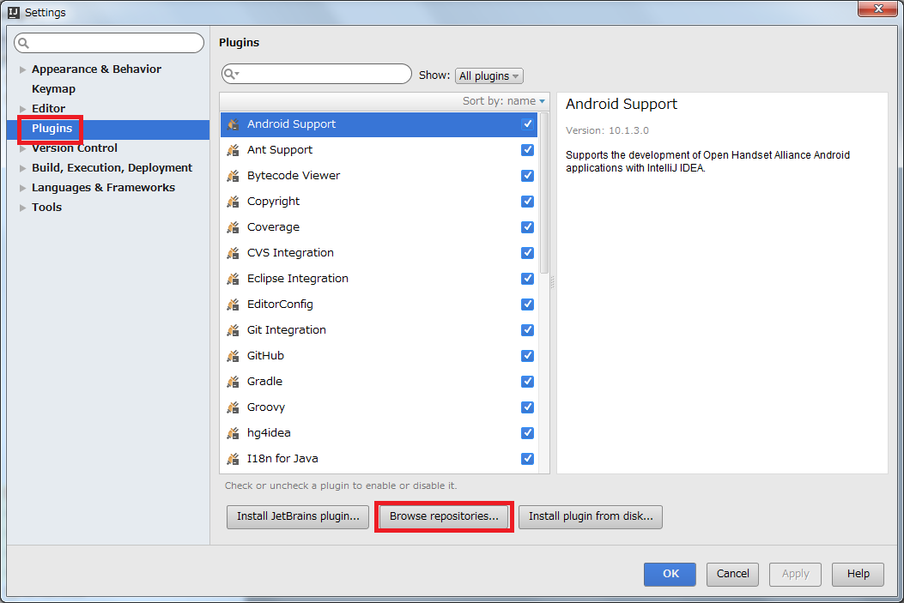
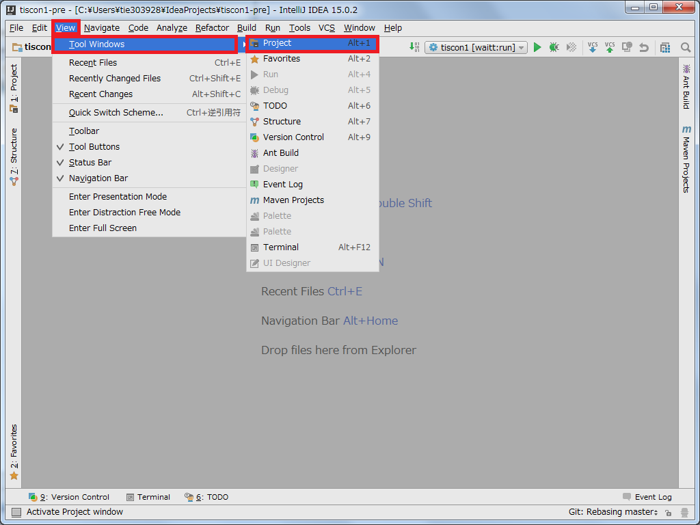
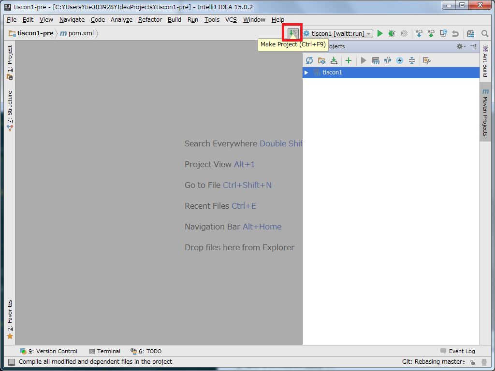
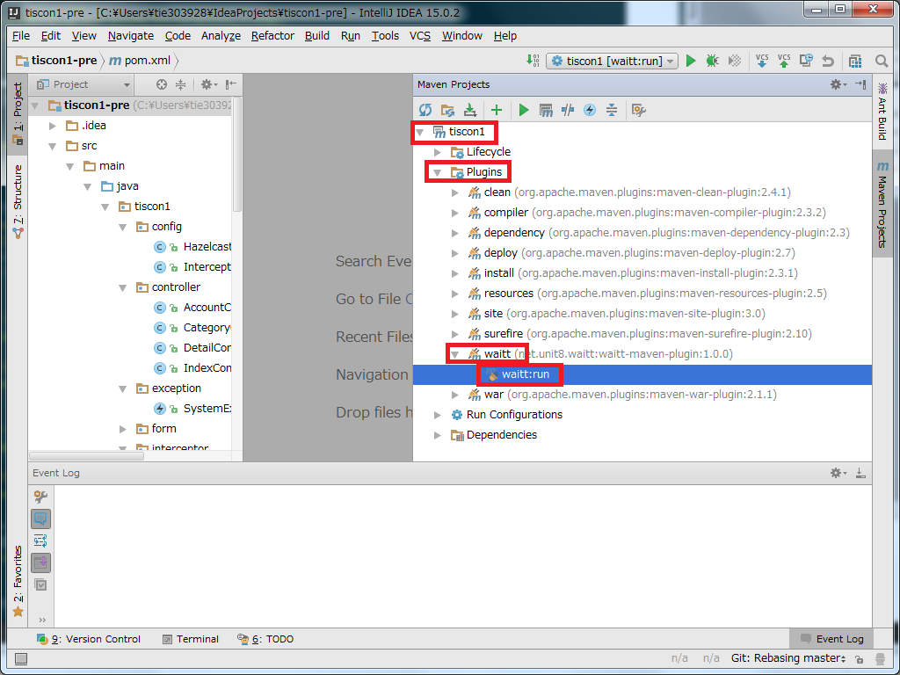
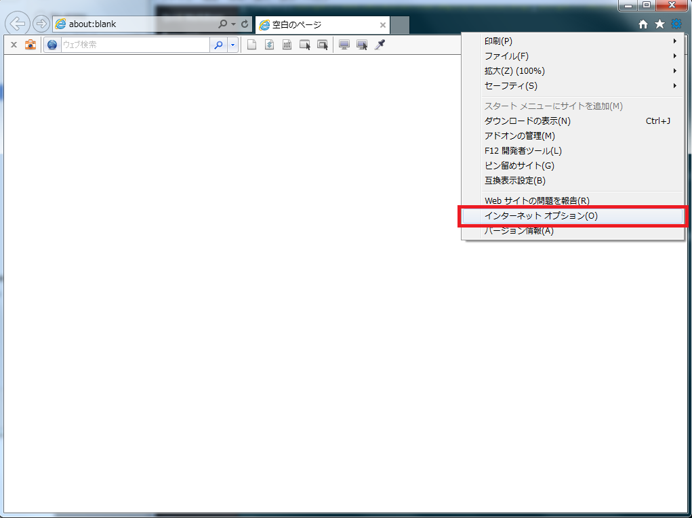
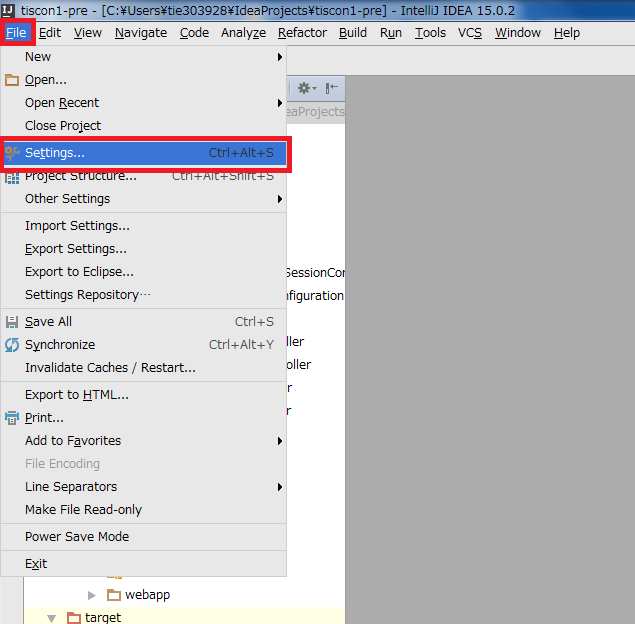
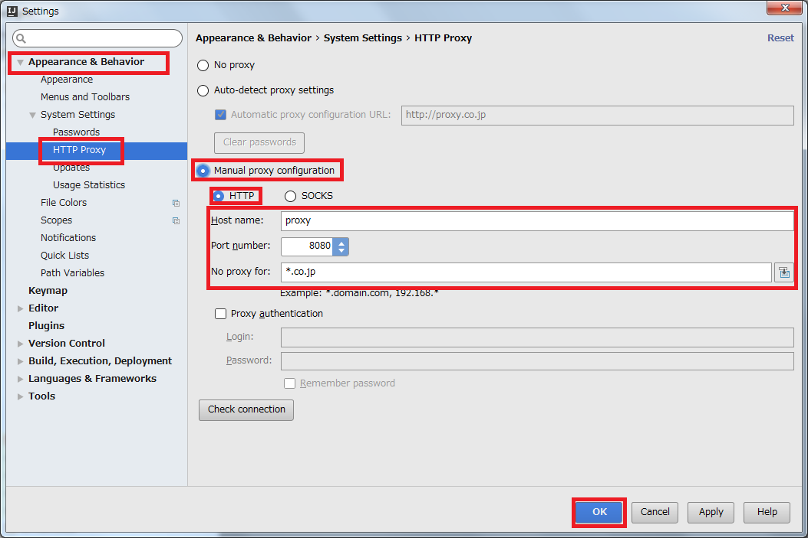
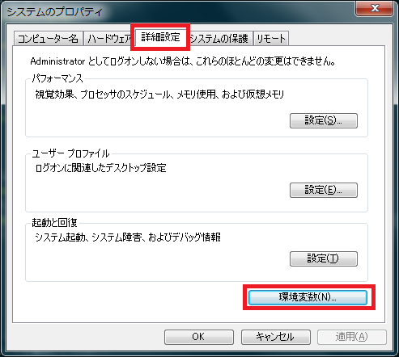
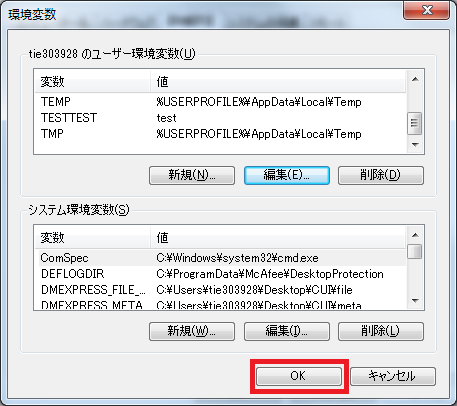

# 環境構築手順
本ドキュメントではtisconプロジェクト動作に必要となる環境構築の手順を示します。
環境構築を行うに当たり、インターネット接続した状態で行って下さい。
また、本ドキュメントは環境構築対象PCのOSがWindowsであると想定しています。
他のOSの場合は、各自適した設定を行うようにしてください。
作業想定時間は☆☆です。当日万全の態勢で臨めるよう、早めに準備しておくよう心掛けてください。

目次は下記の通りです。

[toc]

## JDK8
Java(プログラミング言語)で開発を行うのに必要なソフトウェアをまとめたパッケージです。
下記サイトを参考に、**JDK8のインストール**及び**環境変数の設定**を行って下さい。

[JDK8(Java8)のインストール方法](http://javaworld.helpfulness.jp/post-24/)

## Maven3
Apache Software Foundationで開発されているソフトウェアプロジェクト管理ツールです。
下記サイトを参考に、**Maven3のインストール**及び**環境変数の設定**を行って下さい。

[Apache Maven3 (3.2.5) インストール手順](http://weblabo.oscasierra.net/install-maven-32-windows/)

## IntelliJ IDEA
JetBrains社が開発した統合開発環境です。
下記サイトを参考に、**IntelliJ IDEAのCommunity Editionをインストール**してください。
また、併せてProject Settingsより**JDKの設定**を行って下さい。

[IntelliJ IDEA 14.0.2 インストール手順](http://ksby.hatenablog.com/entry/2014/12/27/233427)
※上記ページに記載されているIntelliJ IDEAに関する項目のみ参照してください。

日本語化したい場合は下記を参考にしてください。
[IntelliJ IDEA 日本語化](http://qiita.com/makoto2468/items/6abf614b82cab865b745)

### プラグインの設定
1. 上部メニューバーより、File > Settings を選択します。

1. Settingsウィンドウが表示されるので、左のバーからPluginsを選択し、Browse repositories...ボタンを押下します。

1. 検索バーに`Lombok`と入力し、Lombok Pluginを選択します。
   右側に表示されるInstallボタンを押下してください。
   　※検索結果が表示されない場合はプロキシ問題である可能性があります。
   　　参考 - プロキシの設定を参照してください。

1. 同様に、検索バーに`Jackson`と入力し、Jackson Generator Pluginを選択します。
   右側に表示されるInstallボタンを押下し、**IntelliJを再起動**してください。

## Heroku
PaaSの1つであり、Webアプリケーションのオンライン上での公開を行えるプラットフォームです。
下記サイトを参考に、**Herokuのアカウント作成**及び**Toolbeltのインストール**までを行って下さい。
[Herokuの準備](http://railsgirls.jp/heroku/)

## Github
Gitリポジトリのホスティングサービスです。
gitに関しては下記を参照してください。
- [Git入門](http://www.backlog.jp/git-guide/intro/intro1_1.html)
- [ギットクエスト](http://unit8.net/gq/)

**アカウント作成**
下記サイトを参考に、**Githubのアカウント作成**を行って下さい。
[GitHub アカウントの作成方法](http://fnya.cocolog-nifty.com/blog/2014/01/github-185e.html)

**tisconのFork**
[github](https://github.com/)にログインし、下記ページの右上にあるForkボタンを押下してください。
[tiscon - Githubページ](https://github.com/tiscon/tiscon1)

## 動作確認
### IntelliJでのプロジェクトのclone手順
1. IntelliJを起動し、Check out fromVersion Control > Git を選択します。
1. Git Repository URLに以下を入力します。
   `https://github.com/[Githubユーザ名]/tiscon1-pre.git`
1. Cloneボタンを押下します。

### ソースコード確認
1. IntelliJ上部メニューバーから、View > Tool Windows > Projectを選択します。

1. Project Viewよりプロジェクト内のソースコードが確認できるようになりました。

### ローカルでの稼働確認
1. IntelliJ上部メニューバーから、View > Tool Windows > Maven Projectsを選択します。

1. 上部のMake Projectボタンを押下します。

2. フッターに*Compilation completed successfully*と表示されたことを確認します。
   Maven Project Viewより、tiscon > Plugins > waitt > waitt:run をダブルクリックしてください。
   アプリケーションが起動したら、ブラウザから http://localhost:8080 にアクセスするとトップページが開きます。
   ※初回実行時は数分かかりますが、以降は10秒ほどでアプリケーションが起動します。

WAITTに関しては下記記事をお読みください。
[Webアプリ開発/テストのお供に『WAITT』](http://qiita.com/kawasima/items/1d4daed6f980b4bfbee3)

### オンライン上での動作確認
Heroku上にデプロイし、オンラインで動作することを確認しましょう。

下記ボタンを押下してください。

## 参考
### 各種ファイルの格納先
基本的にデフォルト設定で問題ありません。

---
### プロキシの設定
自身のPCにプロキシが設定されている場合、別途設定が必要となります。

**自身の設定を確認する**
1. Internet Explorerを起動します。
1. ツール > インターネットオプションを選択します。

1. インターネットオプションウィンドより、接続 > LANの設定を選択します。

1. プロキシ サーバー内の*LANにプロキシサーバを使用する*にチェックがついていた場合、以降のプロキシの設定が必要となります。
   記載されているアドレスとポートを控えておいてください。

---
**IntelliJでのプロキシ設定**
1. IntelliJの上部メニューバーより、File > Settings を選択します。

1. Settingsウィンドウが表示されるので、左のバーからAppearance & Behavior > 一般 > HTTP Proxyを選択します。

1. *HTTPプロキシを使用する*を選択し、各自の設定を記載します。

1. 下部OKボタンを押下します。

---
**Heroku動作のためのプロキシ設定**
環境変数に自身のプロキシについて設定する必要があります。
1. スタート > コンピューターを右クリック > プロパティ > システムの詳細設定を選択してください。

1. システムのプロパティウィンドウの詳細設定 > 環境変数を選択します。

1. ユーザー環境変数内の新規ボタンを押下してください

1. 変数名に`HTTP_PROXY`、変数値に各自の設定を入力し、OKを選択します。

1. 同様に変数名に`HTTPS_PROXY`、変数値に各自の設定を入力し、OKを選択します。

1. 環境変数ウィンドウ内のOKボタンを押下してください。

1. スタート > すべてのプログラム > アクセサリ > コマンドプロンプトを選択してください。

1. コマンドに`set`を入力し、先程入力した設定が反映されていることを確認してください。

---
**Webアプリケーション動作のための設定**

### 作業に行き詰った場合
環境構築にあたり自身で調べてもどうしても上手くいかない場合は、下記のテンプレートを用いてメールにて質問してください。
メールで質問する場合は、スクリーンショットを添付する・エラーメッセージを転記する等、
**自身の状況が詳細に伝わる様**お願いいたします。

---------- テンプレート ここから ----------
メールアドレス：
　めーるあどれす（☆誰の？藤原？？）
件名：
　【インターン環境構築】[作業名]が上手くいきません。
本文：
TIS インターン ITアーキテクトコース 実施担当者様

[所属大学]の[氏名]です。

[参加予定日]のインターン実施に向け、環境構築を行っていましたが、[作業名]が上手くいきません。

【作業状況】
（※環境構築手順のどこまで進めたか記載）

【問題】
（※何が上手くいっていないのか、どのようなエラーが出ているのか記載）

【連絡先】
（※日中連絡がとれる電話番号）

以上です、ご返答の程お願いいたします。

---------- テンプレート ここまで ----------
